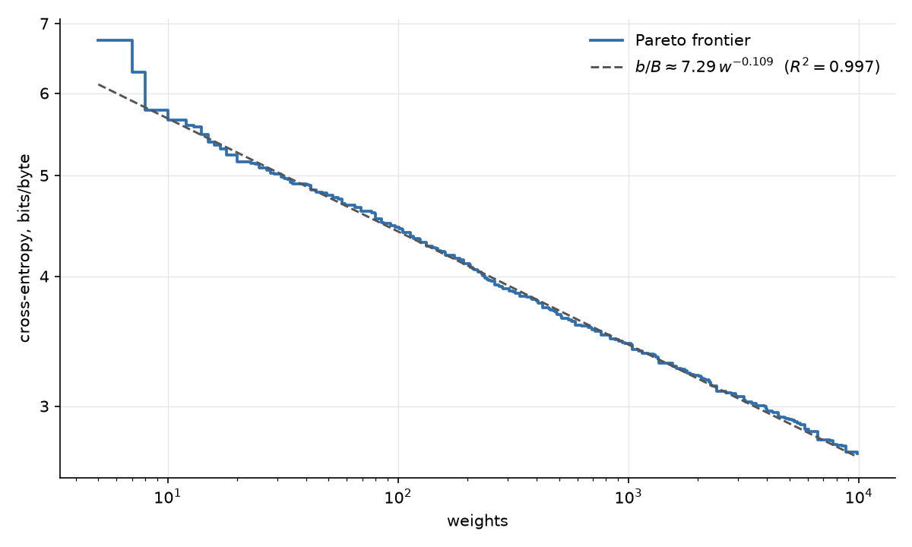
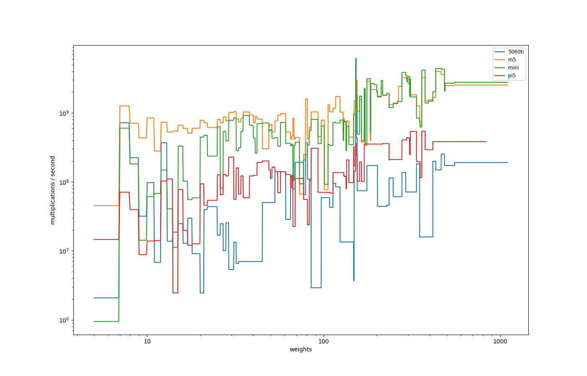

# TexMo

TexMo searches for good small language-model architectures and
metaparameters, starting from the smallest possible models (a handful
of weights) and growing upward. Instead of fixing a single
architecture and scaling it, it explores the joint space of
architectures and hyperparameters, training a large number of small
configurations and using their results to predict where to look next.

Training runs on **JAX**, which is the only backend; see
[`docs/backends.md`](docs/backends.md).

## Highlights

* **The frontier is a power law.** Across eleven weight doublings the
  best per-byte loss tracks **b/B ≈ 7.3 · w^−0.109** (R² = 0.997 in
  log-log): every doubling of the weight budget buys about 7.3% off
  the loss. See the plot below.
* **Search is fast at these scales.** The fastest configuration
  within 1% of the best loss at a weight limit trains to saturation
  in about a second at 100 weights, under ten seconds at 1000, and a
  couple of minutes at 10k.
* **Transformers are close but never ahead.** From 100 to 5000
  weights the best transformer block (attention + FFN, both residual)
  trails the overall best by 2–6% loss; at 10k the gap is currently
  ~9%, but attention is also the youngest arm of the search at the
  heavy end.
* **The most useful non-obvious building block is the minimal gated
  unit** (`mgru` / `mingru`, single-gate GRU variants —
  [`docs/layers.md`](docs/layers.md)): more than half of the frontier
  configurations use one, more than anything except plain dense and
  rnn layers.

## What "good" means here

For every weight budget the search tracks the best cross-entropy loss
achieved on held-out text from an English-language dataset, measured
per input *byte*. Per-byte is the point: models here read their input
in very different units — one bit at a time, 4-bit chunks, or a small
custom tokenset — and only a per-byte score makes those comparable.
Roughly 1.16M training runs across 666k distinct configurations have
been collected so far; the plot below is a periodic snapshot of that
frontier, with the power-law fit drawn in.



Best models found so far at a few sample weight budgets — see
[`docs/best_models.md`](docs/best_models.md) for the full list:

| Weights | Loss   | Spec                                                                                   |
|--------:|-------:|----------------------------------------------------------------------------------------|
| 15      | 5.3849 | `bits.1+bp\|split.cat(rnn.1.tanh, pass)-norm-dense.1.tanh-suffix.2`                     |
| 97      | 4.4564 | `bits.1+bp\|mgru.4-dense.4.gelu-norm`                                                   |
| 231     | 4.0161 | `tokens.32.shift.emb.4\|mingru.4-split.add(rmsnorm, pass)`                              |
| 474     | 3.7044 | `tokens.32.hexbpe.emb.8\|lrnn.8.2`                                                      |
| 2944    | 3.0635 | `bits.4.oh+bp\|rnn.32.gelu-dense.16.gelu-mingru.16`                                     |
| 9824    | 2.6992 | `bits.4.oh+bp\|dense.8.gelu-mullstm.32-dense.64.gelu`                                   |

A spec has the form `<input>|<layer>-<layer>-...`. The part before `|`
names the **codec** — how token ids become vectors going in, and how
the last layer's activations become logits coming out. `bits.1` feeds
a byte one bit at a time, `bits.4.oh` feeds it in two one-hot 4-bit
chunks, and the `+bp` suffix adds a positional encoding for the chunk's
position within the byte. `tokens.32.shift` names a learned tokenset
from `tokens/`, and an `.emb.d` suffix means the ids go through a
learned `d`-wide embedding table that is *tied* into the output head
instead of one-hot vectors. See [`docs/io.md`](docs/io.md) for all
three kinds.

The part after `|` is the layer chain applied at each step (see
[`docs/layers.md`](docs/layers.md) for the full set). It is a DAG, not
a straight line: `split.op(branch, branch)` is a **fork-and-merge**
node where both branches see the same input and their outputs are
combined by `op` ∈ {`add`, `cat`, `mul`}. A branch of `pass` is the
identity, so `split.add(F, pass)` is a residual connection and
`split.mul(value, gate)` is gating. See
[`docs/split.md`](docs/split.md).

## Bytes, bits, and tokensets

TexMo started out refusing tokenization entirely and training directly
on bytes and bit-prefixes, for two reasons:

1. **Tokens encode language knowledge.** A BPE vocabulary trained on a
   large corpus already captures word frequencies and common
   morphology. Counting those bytes-of-text per byte-of-model is
   misleading: part of the language model lives in the tokenizer.
2. **Multiple tokenizations would blow up the search space.** The
   architecture search already covers many degrees of freedom; adding
   "which tokenizer" as another axis would multiply the work without
   informing the comparison between architectures.

Both objections have since been answered rather than avoided, and
small custom tokensets are now a first-class part of the search — they
hold much of the frontier between roughly 200 and 1000 weights.

The first is answered by **charging for what the tokenset knows**. A
set's corpus knowledge is priced into `num_weights` like any other
parameter (one weight per stored choice — a selected byte, a merge, a
shift pair), and a *lossy* set additionally pays a fixed per-byte
residual at eval time for the information it destroys. A model over an
easier token stream therefore does not get a free ride on the
weights-versus-loss plot. The second is answered by making the
tokenset just another neighbor edge: sets form a ladder that the local
search walks one rung at a time, exactly like a layer-size mutation.

[`docs/io.md`](docs/io.md) is the live record of the tokenset families
and this accounting; [`docs/tokens.md`](docs/tokens.md) covers the
machinery (file format, tokenizers, how sets are built).

## Architectures don't scale equally

Per-system throughput at the same near-best loss target:



For these tiny weight budgets a consumer discrete GPU is **outright
slower** than an Apple-silicon laptop running on its CPU cores (not the
GPU via Metal), and even than a Raspberry Pi — except for fixed-suffix
convolution-like models (`suffix.N` + dense), which the GPU handles
well. The reason is that the majority of best-performing
configurations at this scale are **recurrent** (RNN / GRU / mGRU /
minGRU / LSTM / latent-state), and recurrent layers parallelise poorly
across the sequence dimension. CPUs lose less to a small recurrent
step than GPUs lose to under-used SMs.

## Implemented layers

The search composes models from these building blocks (see
[`docs/layers.md`](docs/layers.md) for equations and parameter counts):

- `dense.<size>.<activation>` — feed-forward (tanh, gelu, or bare)
- `rnn.<size>.<activation>` — vanilla recurrent
- `gru.<size>`, `mgru.<size>`, `mingru.<size>` — gated recurrent variants
- `lstm.<size>`, plus the xLSTM/mLSTM family `slstm.<size>`,
  `matlstm.<size>`, `mullstm.<size>`
- `latent.<size>.<reps>`, `lrnn.<size>.<reps>`, `lmgu.<size>.<reps>` —
  depth-recurrent (iterative refinement); `lrnn` and `lmgu` add time
  recurrence on top
- `rglru.<blocks>` — Griffin / RecurrentGemma's gated linear recurrence
- `msr.<dim>.<heads>` — multi-scale retention (linear attention)
- `attn.<size>.<heads>.<window>` — sliding-window multi-query attention
  with rotary embeddings
- `conv.<kernel>` — depthwise causal convolution over time
- `suffix.<length>` — stack the last few positions
- `norm`, `rmsnorm` — L2 normalisation, without and with a learned scale
- `split.<op>(<branch>, <branch>)` — fork-and-merge: residual
  connections and gating (see [`docs/split.md`](docs/split.md))

For the full pipeline (codecs, layer stacking, how a spec becomes a
runnable model), see
[`docs/architecture.md`](docs/architecture.md).

## How the search picks candidates

The space of architectures and metaparameters is far too large to
enumerate, so TexMo uses **local search**: it picks a known-good
configuration, generates its *neighbours* (layer-size mutations,
type swaps, append/remove a layer, precision tweaks — see
[`docs/search.md`](docs/search.md)), and trains promising ones. Two
auxiliary regression models decide which neighbours are promising
before paying for a real training run:

- A **timing model** that predicts per-step training time from
  architecture features and the target system. See
  [`docs/timing.md`](docs/timing.md).
- A **loss-prediction model** trained on the result database itself,
  estimating final loss for unseen configurations. The production
  predictor mirrors the model's own layer tree; an earlier flat RNN
  survives as the baseline. See
  [`docs/loss_prediction.md`](docs/loss_prediction.md) and the
  experiment notes in
  [`docs/loss_rnn_experiments.md`](docs/loss_rnn_experiments.md).

The full distributed loop — server, workers, neighbour generation,
coverage walks across systems — is described in
[`docs/search.md`](docs/search.md).

## Metaparameters

The search currently optimises over:

- **Model architecture** — layer sequence, per-layer sizes, and the
  input codec (including which tokenset)
- **Batch size**
- **Sample length** (context window)
- **Steps**
- **Learning rate**
- **LR decay schedule** (`none` / `exp` / `cosine`) — reached by an
  exp-decay walk plus a cosine toggle; restrict it with
  `--decay-types`. See
  [`docs/decay_and_checkpoints.md`](docs/decay_and_checkpoints.md)
- **Precision** (`fp32` / `fp16` / `bf16` / `fp64`) — mutated alongside
  the architecture; the server defaults to `fp32,fp16,bf16`, and fp64
  is opt-in via `--precision`

## Setup

Before running anything, copy `config_sample.py` to `config.py` and
edit it for this host: training data location, DB path, system name,
server address, and the JAX platforms to initialise. `config.py` is
gitignored — every host gets its own.

## Training a single model

To train one configuration end-to-end and see its loss curve:

```
uv run texmo.py train -s 'bits.1+bp|mgru.4-dense.4.gelu' -b 32 --length 128 --steps 1024 --lr 0.01
```

`-s` is the model spec (see the [conventions](#what-good-means-here)
above), `-b` is the batch size, `--length` is the context window in
*tokens* (which for `bits.1` is bits, not bytes), and `--lr` is the
(initial) learning rate. Add `--no-graph` to skip the plot window when
running non-interactively. See
[`docs/architecture.md`](docs/architecture.md) for the full pipeline.

## Running the search

Server on one machine:

```
uv run texmo.py server -t 1-120 -w 5-800
```

Worker(s) on the same or other machines:

```
uv run texmo.py client
```

Configure system name and server address in `config.py`. The web UI on
port 5000 exposes filters, the Pareto plot, the fastest-near-best
report, and per-system throughput.

## Status

This is a research playground, not a product. Roadmap entries live in
[`docs/roadmap.md`](docs/roadmap.md).
