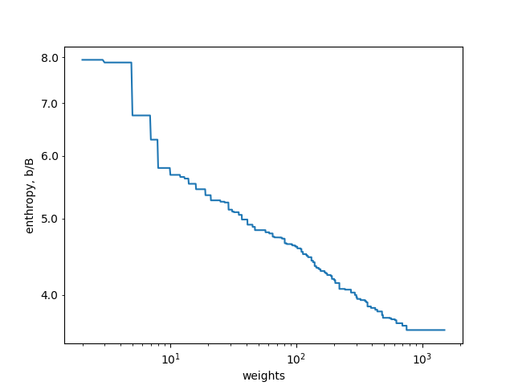

# TexMo — training simple language models

This is a repository in which I attempt to re-implement various machine learning 
algorithms related to language models. All of the ML code is written using JAX, which is basically numpy with JIT compilation and auto differentiation.

**This is a playground where I test various algorithms. Not intended as a useful product.**

## Features

* Selection of a "good" token set based on a given text corpus. (In progress)
* Training a language model with any combination of the following layers:
  * Dense
  * Recurrent
  * LSTM
  * (m)GRU
  * Suffix (stack the last few positions)
  * Attention (with trained relative position encoding)
  * S4
  * RWKV
  * Latent-state recurrent
* Search over a space of metaparameters and model architectures for an optimal configuration given constraints for training time and number of weights.
* Model, predicting the loss of a model with given metaparameters etc.
* Training of pretrained models.
  * Also adding extra layers to a pretrained model making it possible to incrementally train a deep model.

## Results

Here's a graph of cross-entropy loss per input byte for models with tiny number of weights:



These models don't involve tokenization to store all of the knowledge about the text in the weights.

A graph like this can be produced by running

```
uv run texmo.py server -t 1-120 -w 2-800
```

on one machine and

```
uv run client
```

on one or more "worker" machines.

## Training data

I'm mostly using a set of books from [The Pile](https://pile.eleuther.ai/), which amount to around 100 GB. All of the texts are concatenated into a single file. The text is encoded in UTF-8 with `\n` as line ends. Paragraphs are separated by `\n\n`.

### Token sets

The tokenization is designed to work with token sets that could have both small (<256) and big number of tokens.

* In a typical token set each token stands for a byte sequence. Not every byte has to be have a token (otherwise the number of tokens would necessarily be ≥256). A byte in the input text that can't be covered by a normal token is represented by 3 token sequence: `\x10` and two hexadecimal digits (`0`..`f`). For this to work the token set has to have at least 17 tokens, including `\x10` and 16 hexadecimal digits.

* Alternatively bytes not covered by the token set could be encoded as bit sequences with bits represented by two other markers: `\x11` for 0 and `\x12` for 1. However in my tests these kinds of token sets ended up always producing less optimal tokenizations than other options.

* In token sets with 2, 4 or 16 tokens each token stands for 1, 2 or 4 bits in the input text, thus encoding a single byte as 8, 4 or 2 tokens.

* A token set with 8 tokens contains 4 2-bit sequences and 4 tokens standing for the most common 4-bit sequences (aligned to 4 bits): 0001, 0010, 0110, 0111.

### Pre-processing the text before tokenization

Before splitting the text into tokens, it could be processed in 2 ways to simplify extracting words as tokens:

1. Encode capital letters. This allows reusing the same tokens for capitalized and lower-case versions of the same word.

  * A word (a sequence of Unicode letters), which has a uppercase first letter and lowercase subsequent letters is encoded as `\x14` + letters converted to lowercase.
  * A word written in all uppercase letters is encoded as `\x15` + letters converted to lowercase.

2. Add a word-end marker `\x16` at the end of each word (sequence of letter characters) and drop single spaces appearing between words. More formally:
  a) A sequence `letter` `non-letter` is converted to `letter` `\x16` `non-letter`.
  b) A sequence `letter` `\x16` `" "` `letter` is converted to `letter` `\x16` `letter`.

Both these convertions together allow using one token per word in a typical text. Without these processing stages one of two things will happen: either a token would include word + following or preceeding space, and this token wouldn't be used for the same word followed or preceeded by punctuation, or each space between words has to be encoded as an additional token.

Empyrically these processing stages are increasing the average number of bytes per token. For token sets with 32 tokens the optimal tokenization executes just the first processing step (encoding capitalize words). For token sets with 64 or more tokens, the optimal tokenization involves both processing steps.

### Tokenization algorithm

Given a set of byte sequences as tokens, a naive tokenization algorithm would alwas greedily select the longest token matching the current location in text. This however is not optimal. Consider a text `abcdef` and tokens `ab` and `bcdef` (+ single letters). If token `ab` is selected in the beginning of the text, then the rest of the text will be encoded with one token per letter. The optimal tokenization in this case would be: `a` + `bcdef`.

The optimal tokenization could be achieved using a dynamic programming algorithm: an array is maintained with the optimal number of tokens up to any given position in text. In each new position all the possible end tokens are tried, choosing the one that restults in the lowest possible number of tokens up to a given location.

To optimize this algorithm we need a way to quickly iterate through all possible tokens ending at a given position in the text. This is done through two tricks:

1. Each token maintains a pointer to the longest other token which is a suffix of the current token. Using this, once we know the _longest_ token at the current position, we could iterate through other matching tokens as a linked list.

2. Before scanning the text we are constructing a finite-state machine for different "interesting" suffixes. We include one state for each string which is a prefix of any token in our set. Each such state includes a pointer to the longest token which is a suffix of the string in the current state. Each state also includes an array of 256 next states, depending on the next input byte.

It is easy to prove that this finite-state machine would be able to always produce the longest token matching the current suffix. (I'm almost sure this is called an Algorithm of Someone-or-Other, though I don't know whether I've seen it in this exact form anywhere.)

This algorithm produces a provably optimal tokenization in terms of the numeber of tokens. The Rust implementation can scan 50-100 MB of text per second in a single thread (depending on the number of tokens in the token set).

### Optimizing the set of tokens

I'm roughly following the BPE algorithm to optimize the set of token. The algorithm goes like this:

1. The set of tokens is initialized either with a smaller token set, or with a set of mandatory tokens (`\x10`, `0`..`9`, `a`..`f` if we fall back to hexadecimal encoding of missing bytes).

2. We tokenize the whole corpus with the current set of tokens, counting the occurences of token bigrams (pairs of subsequent tokens) and non-token characters encoded as token sequences. The most common bigram or non-token is added as a new token. (The count of non-tokens is multiplied by the number of tokens in its encoding –1.)

3. If the number of tokens in the set is greater than the number of tokens that we are aimning for, now we search for a token that we could remove from the set without increasing the number of tokens too much.

  a. To do that first we tokenize the dataset with the new set of tokens and iterate over tokens in the order of increasing number of occurences of the token in the text.

  b. For each token we try removing it, re-tokenize the text, count the text and if it's lower than the number of the tokens before step 2, then we remove this token and go back to step 2.

4. After the last iteration in which we didn't manage to find a token removing which would decrease the number of tokens in the tokenization, we stop.


### Implementation

The algorithm described above is implemented in Rust, since it requires high performance and benefits from parallelization. On my MacBook Pro working in 10 threads it scans 800-900 MB of input data per second, resulting in a single tokenization of all the training corpus in around 2 minutes.

To run the optimization, execute:

```
texmo -d <training data> optimize-tokens -n <desired number of tokens> [-i <starting token set>] -o <output token set> [--fallback2]
```

If `--fallback2` argument is given and no starting token set is provided, the algorithm will encode non-token characters as 8 bits, using `\x11` and `\x12` characters. Otherwise it will encode them as hexadecimal, using `\x10` and two hexadecimal digits.

## Train model

```
python3 texmo.py train -s rec.128.relu-gru.512.tanh-dense.128 -t 3600 -o models
```

## Client-server search

In this mode a single system maintains a database of all the results and performs a search over the space of possible models and metaparameters. The client systems can send a request over HTTP to get a configuration that they are going to run and then submit the results back to the server.

The server is run by

```
uv run texmo.py search -s <spec regex> -p <precisions> -b <batch sizes> ...
```

specifying the space of considered configurations.

The client system is run with

```
uv run texmo.py client
```

(specifying the name of the system and the address of the server in `config.py`)

Search parameters could be controled via the web interface on port 5000.